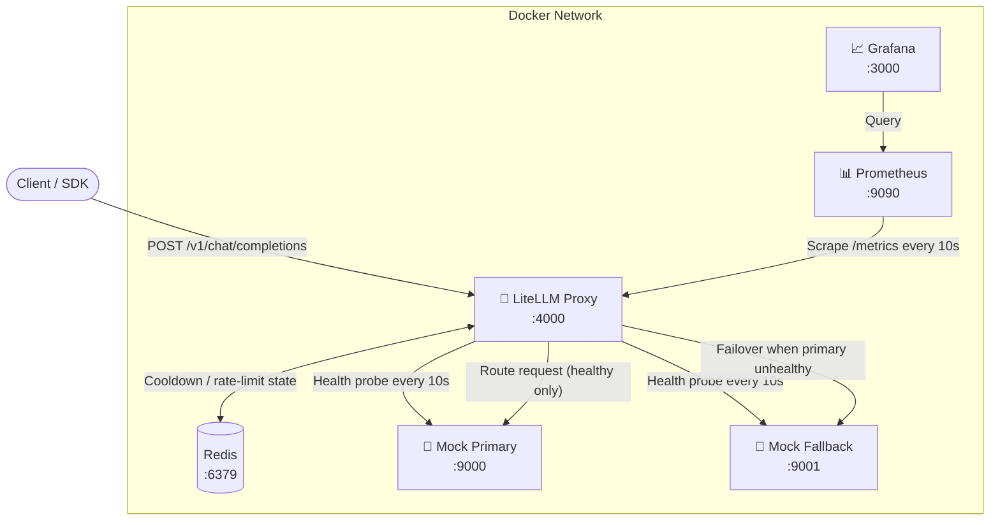

# Enterprise AI API Gateway

[](https://github.com/Mahoragaa/Enterprise-AI-API-Gateway/actions/workflows/ci.yml)
[](LICENSE)
[](docker-compose.yml)
[](https://docs.litellm.ai)

A production-grade **LLM Proxy Gateway** built on [LiteLLM](https://docs.litellm.ai) demonstrating two critical enterprise AI infrastructure patterns:

| Feature | What it does |
|---|---|
| 🏥 **Proactive health-check routing** | Background probes remove dead endpoints *before* users hit errors — zero user-facing 5xx during provider outages |
| ⚡ **Dynamic priority rate limiting** | At 50% capacity saturation, critical teams (engineering) get full bandwidth while low-priority teams (marketing) receive 429s |

---

## Architecture



---

## Project Structure

```
Enterprise-AI-API-Gateway/
├── .env.example                     # Environment variable template
├── .github/workflows/ci.yml         # GitHub Actions CI pipeline
├── docker-compose.yml               # 6-service orchestration
├── litellm_config.yaml              # Gateway config (health + priority)
├── requirements.txt                 # Test harness + load test deps
├── setup_teams_and_test.py          # End-to-end test harness
├── LICENSE
├── mock_provider/
│   ├── Dockerfile                   # Hardened, non-root image
│   ├── requirements.txt
│   └── main.py                      # FastAPI mock + poison-pill control plane
├── observability/
│   ├── prometheus/
│   │   └── prometheus.yml           # Scrape config
│   └── grafana/
│       └── provisioning/
│           ├── datasources/         # Auto-wired Prometheus datasource
│           └── dashboards/          # Pre-built dashboard (auto-loaded)
└── load_test/
    └── locustfile.py                # Multi-team Locust load test
```

---

## Quick Start

### Prerequisites
- [Docker Desktop](https://www.docker.com/products/docker-desktop/) (with Compose v2)
- Python 3.11+ (for running test scripts locally)

### 1. Clone and configure

```bash
git clone https://github.com/Mahoragaa/Enterprise-AI-API-Gateway.git
cd Enterprise-AI-API-Gateway
cp .env.example .env          # defaults work out-of-the-box
```

### 2. Start the stack

```bash
docker compose up --build -d
```

All 6 services start with dependency healthcheck gates — LiteLLM waits until Redis and both mock providers are ready.

### 3. Verify everything is healthy

```bash
# Gateway liveness
curl http://localhost:4000/health/liveliness

# Full model health (shows healthy/unhealthy deployments)
curl http://localhost:4000/health -H "Authorization: Bearer sk-master-key-1234" | python -m json.tool

# Mock providers
curl http://localhost:9000/health    # primary
curl http://localhost:9001/health    # fallback
```

### 4. Run the test harness

```bash
pip install -r requirements.txt
python setup_teams_and_test.py
```

---

## Services & Ports

| Service | URL | Credentials |
|---|---|---|
| **LiteLLM Gateway** | http://localhost:4000 | Master key: `sk-master-key-1234` |
| **LiteLLM Admin UI** | http://localhost:4000/ui | Master key: `sk-master-key-1234` |
| **Mock Primary** | http://localhost:9000 | — |
| **Mock Fallback** | http://localhost:9001 | — |
| **Prometheus** | http://localhost:9090 | — |
| **Grafana** | http://localhost:3000 | `admin` / `gateway123` |

---

## Demo: Health-Check Failover

```bash
# 1. Watch the primary serve traffic normally
curl http://localhost:9000/admin/status

# 2. Poison the primary (simulates a provider outage)
curl -X POST http://localhost:9000/admin/poison

# 3. LiteLLM detects failure within 10s — send a request to the gateway
#    It routes to the fallback with ZERO user-facing errors
curl http://localhost:4000/v1/chat/completions \
  -H "Authorization: Bearer sk-master-key-1234" \
  -H "Content-Type: application/json" \
  -d '{"model":"gpt-4o","messages":[{"role":"user","content":"Hello"}]}'

# 4. Restore the primary
curl -X POST http://localhost:9000/admin/cure
```

**Mock provider control plane endpoints:**

| Endpoint | Effect |
|---|---|
| `POST /admin/poison` | Returns 503/500 — simulates hard outage |
| `POST /admin/cure` | Restores normal operation |
| `POST /admin/slow?delay_seconds=5` | Adds artificial latency (triggers timeout policy) |
| `POST /admin/fast` | Disables slow mode |
| `GET  /admin/status` | Inspect current state |

---

## Demo: Priority Rate Limiting

```bash
# Run the automated demonstration (creates teams, fires 60 concurrent requests)
python setup_teams_and_test.py
```

Or run a sustained Locust load test:

```bash
# Web UI at http://localhost:8089
locust -f load_test/locustfile.py --host http://localhost:4000

# Headless — 50 users for 60 seconds
locust -f load_test/locustfile.py \
  --host http://localhost:4000 \
  --headless --users 50 --spawn-rate 5 --run-time 60s
```

---

## Configuration

### Health-Check Routing (`litellm_config.yaml`)

```yaml
general_settings:
  background_health_checks: true         # proactive probes
  health_check_interval: 10             # every 10 seconds
  enable_health_check_routing: true     # exclude unhealthy deployments
  health_check_ignore_transient_errors: true  # ignore 429/408 noise

router_settings:
  cooldown_time: 60                      # 60s cooldown after threshold
  allowed_fails_policy:
    TimeoutErrorAllowedFails: 1          # cooldown on 2nd timeout
    AuthenticationErrorAllowedFails: 1   # cooldown on 2nd auth error
```

### Priority Rate Limiting (`litellm_config.yaml`)

```yaml
litellm_settings:
  saturation_threshold: 0.50   # priority enforcement at 50% capacity
  default_priority: 0.1        # unkeyed requests are deprioritised
  success_callback: ["prometheus"]
  failure_callback: ["prometheus"]
```

---

## Observability

Open **Grafana at http://localhost:3000** (admin / gateway123) — the **Enterprise AI API Gateway** dashboard is pre-loaded with:

- 🟢 Service health status (UP/DOWN) per deployment
- 📈 Request rate and error rate by model
- ⏱ Latency percentiles (p50 / p95 / p99)
- 🏷 Team-level traffic breakdown
- 🔢 Token usage by model

Prometheus raw metrics are available at http://localhost:9090.

---

## Running Tests

```bash
# End-to-end test harness (creates teams, tests failover + priority)
python setup_teams_and_test.py

# Locust load test
locust -f load_test/locustfile.py --host http://localhost:4000 --headless \
  --users 50 --spawn-rate 5 --run-time 60s
```

---

## Contributing

See [CONTRIBUTING.md](CONTRIBUTING.md) for local dev setup and how to add new failure modes to the mock provider.

---

## License

[MIT](LICENSE) © 2026 Raghav Arora
